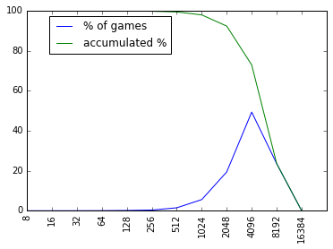
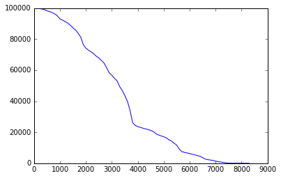

# 2048 Deep Learning AI

I didn't think neural network is particularly suitable for solving 2048 puzzle, but I implement one anyway. Turns out the result is not too bad, at least much better than I expected.

See it in action http://tjwei.github.io/2048-NN/ and in Video https://www.youtube.com/watch?v=oRC2W38lxIE

Nueral Netowrk AI for the game [2048](https://github.com/gabrielecirulli/2048).

It is a fork of http://ov3y.github.io/2048-AI/ and replace the AI part by a neural network.

The neural network is pretrained using Theano and lasgane by observing simulated games and supervised by an advance AI https://github.com/nneonneo/2048-ai

The trained neural network can achieve 2048+ in >94% of the games. It reaches 4096 in >78% of the games and reaches 8192 in >34% of the games There is a small chance(but > 0.1%) the AI can reach a max tile of 16384.

It may sometimes ended with an embarrassingly low score.

The following is the result of 100K games played by the neural network

|max tile| % of games| accumulated %| reversed accumulated %| 
|--------|-----------|--------------|---------|
|16384   | 0.177%    |        0.177%|100.000%|
|8192    |34.500%    |       34.677%| 99.823%|
|4096    |43.819%    |       78.496%| 65.323%|
|2048    |15.656%    |       94.152%| 21.504%|
|1024    | 4.340%    |       98.492%|  5.848%|
|512     | 1.144%    |       99.636%|  1.508%|
|256     | 0.261%    |       99.897%|  0.364%|
|128     | 0.064%    |       99.961%|  0.103%|
|64      | 0.026%    |       99.987%|  0.039%|
|32      | 0.007%    |       99.994%|  0.013%|
|16      | 0.005%    |       99.999%|  0.006%|
|8       | 0.001%    |      100.000%|  0.001%|

or in graph

The average score is 85351.8 and the average length of a game is 3733.6 steps.

The following graph shows how many games left after certain steps in the 100K simulations:

The graph indicates that the AI performs relatively weak in early stage of the game.

Without the help of human made features and heuristics like what is used in https://github.com/nneonneo/2048-ai , the network can still reaches at least 75% success rate for the same network architecture. 

A much smaller model trained without using any human made features and heuristics reaches 47% of success rate, can be found at http://github.ocm/tjwei/rl/

The `animationDelay` is set to 10. You can make it run faster or slower with a different delay time. 

